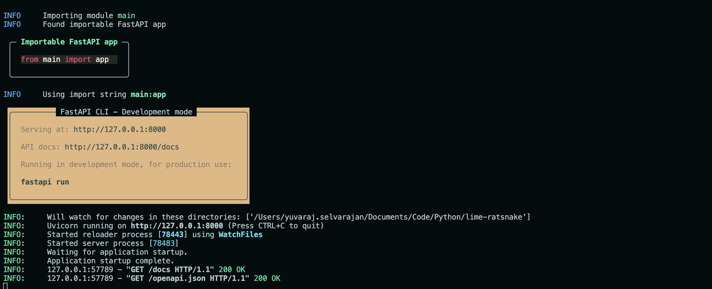
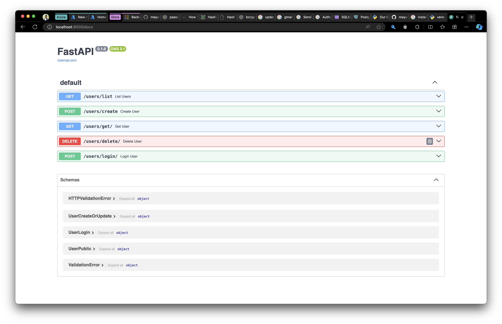

# Introduction 

This app `lime-ratsnake` works as a backend service for a blood donor collaboration site. This app uses the below components for the backend. 


| Component | Purpose | Docs | 
| --- | --- | --- | 
| fastapi | Backend framework | [Click here](https://fastapi.tiangolo.com/) |
| sqlmodel | Object Relational Mapper based on sqlalchemy | [Click here](https://sqlmodel.tiangolo.com/) |
| uv | An extremely fast Python package and project manager, written in Rust. | [Click Here](https://docs.astral.sh/uv/) | 
| ruff | An extremely fast Python linter and code formatter, written in Rust. | [Click here](https://docs.astral.sh/ruff/) | 
| postgresql | An open source backend relational database | [Click here](https://www.postgresql.org/) | 
| Python | High Level Programming langugage used for backend | [Click here](https://www.python.org/doc/) | 


# Folder

The folder structure would be as follows: 

```
./src
├── __pycache__
│   ├── main.cpython-311.pyc
│   └── main.cpython-313.pyc
├── classes
│   ├── __pycache__
│   └── passwords.py
├── main.py
└── models
    ├── __pycache__
    └── models.py

6 directories, 5 files
``` 

## Folder structure 
- `src` folder contains all the code for the app 
- `classes` would contain the necessary classes
- `models` any database models would be located here

# How

- Clone this repo using either `git clone` or `gh repo clone` command.
```sh
git clone https://github.com/meyuviofficial/lime-ratsnake.git 
```
```sh
gh repo clone meyuviofficial/lime-ratsnake
``` 
- Install the required packages via `uv` or `pip`
```sh
pip install -r requirements.txt
```
```sh 
uv pip sync requirements.txt
```
- Once the installation is done, enable the virtual env using 
```sh
venv .
```
```sh 
uv venv
```
> Once done, please activate it using : `source .venv/bin/activate` command

- First install the postgresql database server and run it using 
```sh
pg_ctl -D ./data -l logfile start
```
> NOTE: please make sure `./data` directory is present already
- After that, try to create a user and db using the following commands
```sh
createuser -dls <user_name> 
createdb -O <user_name> <db_name> 
```
- Now, try to login to the server using `psql` 
```sh
psql -h localhost -U <user_name> <db_name>
```
- Finally, try to run the server using 
```sh
fastapi dev src/main.py
# or
fastapi run src/main.py # for prod mode
```



The detailed docs can be found in the path  `/docs` as below. 
> If you're running from the local, then it would `localhost:<port>/docs` 

